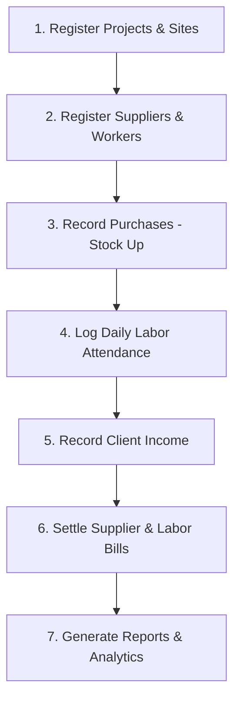

# BuildTrack Pro - User Guide

Welcome to **BuildTrack Pro**, your comprehensive solution for managing construction projects, inventory, labor, and finances. This guide will help you navigate and use the application effectively.

---

## 1. System Workflow Diagram
Follow this logical flow to ensure all data is correctly linked and balances are accurate:

---

## 2. Dashboard
> **Dashboard Overview**
> The Dashboard provides real-time summaries of your business health, including Total Income, Total Expenses, and Outstanding Balances.

The Dashboard is your command center. It provides a high-level overview of your business:
- **Key Metrics**: View total outstanding balances, active projects, and recent financial activity.
- **Quick Links**: Access frequently used modules directly.
- **Visual Summaries**: Charts and graphs showing your income vs. expenses.

## 3. Data Entry & System Impact (How it Works)
Every entry you make in BuildTrack Pro triggers specific updates across the system. Here is how different entries "hit" your records:

### A. Project Registration
- **How to enter**: Go to "Sites" > "Register Project". Enter Name, Budget, and Client info.
- **System Impact**: Creates a dedicated ledger for that site. All future labor, materials, and expenses assigned to this project will be tracked against its budget.

### B. Material Purchases (Expenses)
- **How to enter**: Go to "Finance" > "Record Expense". Select "Purchase", choose a Supplier, Material, and Quantity.
- **System Impact**:
    1. **Supplier Balance**: Increases the amount you owe to the vendor.
    2. **Inventory**: Automatically adds the quantity to your stock (Godown or Site).
    3. **Project Cost**: If assigned to a site, it immediately updates the site's "Material Cost" metric.

### C. Labor Logs (Attendance)
- **How to enter**: Go to "Labor" > "Log Work". Select the worker, project, and date.
- **System Impact**:
    1. **Worker Balance**: Increases the worker's "Earned" amount based on their daily rate.
    2. **Project Cost**: Updates the site's "Labor Cost" in real-time.

### D. Material Usage & Transfers
- **How to enter**: Go to "Stock" > "Transfer Material". Select source (e.g., Godown) and destination (Project Site).
- **System Impact**: Deducts stock from the source and adds it to the destination. This helps you track exactly how much material is actually consumed at each site versus what is sitting in the warehouse.

### E. Client Income
- **How to enter**: Go to "Revenue" > "Record Income". Select the project and enter the amount received.
- **System Impact**: Increases your "Total Income" and improves the project's profit margin. It helps you see if you are spending more than you are receiving from the client.

### F. Supplier Payments
- **How to enter**: Go to "Suppliers" > "Record Payment" or use the "Settle Bill" button in the ledger.
- **System Impact**: Deducts the amount from your outstanding balance with that supplier. It records a financial outflow from your bank or cash account.

## 4. Prerequisites & Dependencies (What to add first?)
To ensure data integrity, some entries cannot be made until their "parent" records are registered. Follow this order for a smooth setup:

### A. Inventory (Stock) Entries
**Prerequisite:** You MUST add a **Supplier (Vendor)** before recording a material purchase.
- You cannot "Purchase" cement if the Cement Supplier is not in the system.
- Go to **Suppliers > Register Supplier** first.

### B. Labor & Attendance Logs
**Prerequisite:** You MUST add an **Employee** and a **Project Site** first.
- You cannot log work for "John" if John is not registered in the workforce.
- You cannot assign work to "Site A" if Site A is not registered.

### C. Financial Payments (Supplier/Labor)
**Prerequisite:** There must be an **Outstanding Balance** or a **Bill** to settle.
- **Supplier Payments:** Work best when you use the "Settle Bill" button inside the Supplier Ledger. This links the payment directly to a specific material batch.
- **Labor Payments:** Require the worker to have "Earned" some amount through work logs first.

### D. Invoices & Income
**Prerequisite:** A **Project Site** must exist.
- All revenue is linked to a site. Register the site under **Sites** before logging any client payments.

### Summary of Entry Flow:
1. **Step 1:** Register your **Projects** and **Suppliers**.
2. **Step 2:** Register your **Workforce (Employees)**.
3. **Step 3:** Record **Expenses/Purchases** (linked to Suppliers).
4. **Step 4:** Log **Labor Work** (linked to Employees & Projects).
5. **Step 5:** Record **Payments** to clear balances.

## 5. Project Management 
### Form Mockup: Register New Project
| Field | Example Value |
| :--- | :--- |
| **Project Name** | City Mall Phase 1 |
| **Client Name** | ABC Developers |
| **Total Budget** | 5,000,000 PKR |
| **Start Date** | 2026-03-24 |

Manage all your construction sites in one place:
- **Register Project**: Click "Register Project" to add a new site. Provide the name, client details, and budget.
- **Project Details**: Click on any project to view its specific ledger, material arrivals, labor logs, and invoices.
- **Status Tracking**: Update project status (Active, Completed, On Hold) to keep your list organized.

## 6. Labor & Workforce 
### Form Mockup: Log Daily Work
| Field | Example Value |
| :--- | :--- |
| **Select Worker** | Ahmed Ali (Mason) |
| **Select Project** | City Mall Phase 1 |
| **Work Date** | 2026-03-24 |
| **Daily Rate** | 1,500 PKR |

Keep track of your workers and their payments:
- **Worker Registry**: Add workers with their trade (Mason, Laborer, etc.) and daily rates.
- **Attendance/Work Logs**: Record daily work for each project.
- **Payment Management**: Track advances and final payments made to workers.

## 7. Inventory & Materials 
### Form Mockup: Transfer Material
| Field | Example Value |
| :--- | :--- |
| **Material** | Cement (Bags) |
| **Quantity** | 50 |
| **From Source** | Main Godown |
| **To Destination** | City Mall Phase 1 |

Monitor your stock levels and material movements:
- **Stock Overview**: View current quantities of materials (Cement, Bricks, Steel, etc.) across all sites.
- **Purchase Materials**: Record new purchases to update inventory levels.
- **Material Usage**: Track when materials are moved from the godown (warehouse) to specific project sites.

## 8. Supplier (Vendor) Management 
### Form Mockup: Register Supplier
| Field | Example Value |
| :--- | :--- |
| **Supplier Name** | Lucky Cement Ltd |
| **Category** | Cement |
| **Contact Number** | +92 300 1234567 |
| **Opening Balance** | 0.00 |

Manage your relationships with material suppliers:
- **Supplier Registry**: Register suppliers and categorize them (e.g., Hardware, Sand, Bricks).
- **Outstanding Balances**: Monitor how much you owe to each supplier.
- **Supplier Ledger**: View a detailed history of all purchases and payments for a specific supplier.

## 9. Financial Tracking (Income & Expenses) 
### Form Mockup: Record Expense
| Field | Example Value |
| :--- | :--- |
| **Expense Type** | Material Purchase |
| **Supplier** | Lucky Cement Ltd |
| **Amount** | 75,000 PKR |
| **Project** | City Mall Phase 1 |

Stay on top of your cash flow:
- **Expense Tracker**: Record every expense, from material purchases to site overheads.
- **Project Income**: Log payments received from clients.
- **Zebra Striping**: Tables are designed with alternating row colors for better readability of long financial lists.

## 9. Invoicing 
Professional billing for your clients:
- **Create Invoices**: Generate invoices for projects based on work completed or milestones.
- **Payment Status**: Track which invoices are Paid, Partially Paid, or Pending.
- **Print/Export**: (Coming Soon) Prepare invoices for sharing with clients.

## 10. Reports & Analytics 
Data-driven insights for your business:
- **Financial Reports**: View profit/loss summaries by project or time period.
- **Material Consumption**: Analyze material usage patterns to optimize future purchases.

---

### Tips for Success:
- **Regular Updates**: Update your labor logs and expenses daily for the most accurate dashboard metrics.
- **Search & Filter**: Use the search bars at the top of each list to quickly find specific projects, vendors, or transactions.
- **Dark Mode**: Toggle between light and dark themes in the settings for comfortable viewing in any environment.

---
*Generated by BuildTrack Pro Support*
